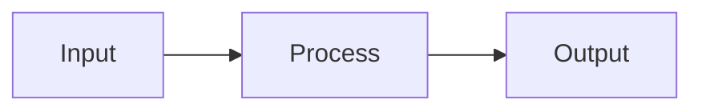

# Document Enhance

Turn markdown into a README that looks good on GitHub and is easy to use. Follow the patterns below and make sure every mention of something linkable becomes a link.

## Inputs

Before you write, get:

1. **Project** – What it is, what it does, who it’s for.
2. **Assets** – Logo, banner, screenshots, GIFs (paths or URLs). **Social share image** – The image used when the repo link is shared. See Process and Patterns.
3. **Optional sections** – Contributors, roadmap, FAQ, “why this over X”, sponsors, license.

Use `[BRACKETS]` for anything the user must fill in. Output one full `README.md`.

## Output

One complete `README.md` (to a file or for download), using the patterns below and `[BRACKETS]` where the user supplies content.

## Process

### 1. Gather

Ask what the project is, what it does, who it’s for, and what assets exist (logo, banner, screenshots, GIFs). Ask which optional sections they want (contributors, roadmap, FAQ, etc.). Ask for or confirm the **social share image** — the image that appears when the repo link is shared. It can be the hero image, or a dedicated image they provide.

### 2. Link everything that can be linked

**Rule:** If the text mentions something that has a URL or path, add a link. Don’t leave readers guessing where to go.

- **Example of failing:** A README says “Product Studio wires researcher, documenter, strategist, verifier, and other subagents to workflows” and “Skills live under `.claude/skills/`” but never links to `.claude/agents` or `.claude/skills` or the subagents/skills sections. Fix: link “subagents” to `.claude/agents` or the “Subagents and their skills” section; link “skills” to `.claude/skills` or that section; link named subagents/skills to their cards or files where they’re defined.
- **Apply everywhere:** Section names, file paths, tool names, repos, docs. If it’s linkable, link it. Use relative links for in-repo paths.

**When enhancing a README, link every mention of:**

- **Slash commands** – e.g. `/install`, `/analyze-figma`, `/research`, `/save`. Link each to its skill: `[\`/install\`](.claude/skills/install/SKILL.md)` (adjust path to match the repo).
- **Trigger phrases or skill names** – e.g. "install", "research", "document". Link to the skill: `[install](.claude/skills/install/SKILL.md)`.
- **Directory paths** – e.g. `.claude/agents/`, `.claude/skills/`. Use relative links: `[.claude/agents/](.claude/agents/)`, `[.claude/skills/](.claude/skills/)`.
- **Skill names in body text** – document, document-paths, analyze-figma, verify-docs, clean, save, etc. Link each to its SKILL.md: `[analyze-figma](.claude/skills/analyze-figma/SKILL.md)`.
- **Agent/subagent names** – When mentioned in prose, link to the agent file: `[installer](.claude/agents/installer.md)`.
- **Repo file paths** – e.g. `work/paths.md`, `work/paths.md.template`, `.tmp/`. Link the path: `[work/paths.md](work/paths.md)` (or to a section if the file is gitignored and you prefer an anchor).
- **Section names** – Link to in-page anchors where it helps (e.g. `[Subagents and their skills](#-subagents-and-their-skills)`).

### 3. Produce and deliver

Build the full README from the patterns below, with `[BRACKETS]` for user content. Write to file or output for download.

## Patterns (use these in the README)

### Hero and centered title

Centered main title (GitHub renders the HTML):

```html
<p align="center">
  <strong>[Project Name]</strong><br/>
  [One-line tagline]
</p>
```

Or shorter: `[Project Name] – [tagline]`.

### Doc/source strip (below hero)

Horizontal rule, then links:

```markdown
---

**Documentation**: [https://[docs-url]](https://[docs-url])

**Source Code**: [https://github.com/[OWNER]/[REPO]](https://github.com/[OWNER]/[REPO])

---
```

### Tagline blockquote

One clear line:

```markdown
> [Catchphrase or positioning statement.]
```

### Feature list (bold key + description)

```markdown
The key features are:

* **Fast**: [Description.]
* **Easy**: [Description.]
* **Short**: [Description.]
```

### Screenshot / GIF

Put one strong visual early, right after the intro. Use Markdown image syntax. For files in the repo (especially GIFs), use the raw URL so they load and animate on GitHub. See [document-github](../document-github/SKILL.md).

```markdown
![[Alt text]]([URL])
```

Raw URL form: `https://raw.githubusercontent.com/[OWNER]/[REPO]/[BRANCH]/[path]/file.gif` (or .png).

### Social share image

**Rule:** Set a social share image so the repo looks good when the link is shared. GitHub uses the repo’s social preview; set it in the repo under Settings → General → Social preview, or document where to set it.

- **Option A – Use the hero image:** If the hero (screenshot or GIF) works as the preview, use that image URL. Static images work best for previews; animated GIFs may show as a static frame.
- **Option B – Dedicated image:** Put a dedicated image in the repo, e.g. `assets/social.png` or `assets/og-image.png`, typical size 1280×640 or 1200×630. Use that URL for the social preview. Tell the user to add the file and set it in GitHub under Settings → Social preview or in their docs site’s meta tags.

In the README or in delivery notes, say which image is set or should be set and where: e.g. “Social preview: use `assets/hero.gif`” or “Add `assets/social.png` and set it in repo Settings → Social preview.”

### Code block (quickstart)

Set the language for highlighting. Keep it minimal.

````markdown
```[lang]
[Minimal runnable snippet]
```
````

You can add expected output in a second block or inline.

### Collapsible sections

```html
<details>
<summary>Click to expand: [Section title]</summary>

[Markdown and code here.]

</details>
```

### Contributor grid (contrib.rocks)

```markdown
## Contributors

<a href="https://github.com/[OWNER]/[REPO]/graphs/contributors">
  
</a>
```

Optional: `?max=24&columns=6` on the image URL.

### Section dividers

Use `---` between major sections so the page is easy to scan.

### Centered footer

```html
<p align="center">
  <sub>Built with [optional emoji]. Licensed under [LICENSE].</sub><br/>
  <sub>If this helped you, consider <a href="https://github.com/[OWNER]/[REPO]">giving it a star</a>.</sub>
</p>
```

### Mermaid diagrams

GitHub renders Mermaid in `.md`. Use for flow or architecture:

````markdown

````

### Headings and emoji

Use clear hierarchy: one `#` (title), then `##` for main sections, `###` for subsections. Emoji at the start of headings can help scanning (e.g. ## Features, ## Installation).

### Table of contents (long READMEs)

```markdown
## Table of contents

- [Features](#features)
- [Installation](#installation)
- [Usage](#usage)
- [Contributing](#contributing)
- [License](#license)
```

Anchors: see [document-github](../document-github/SKILL.md) (lowercase, spaces to hyphens).

### Comparison / “why this” table

Use check/cross or emoji for quick scan:

```markdown
| Feature        | This project | Alternative X |
|----------------|--------------|---------------|
| Speed          | Yes          | No            |
| Easy setup     | Yes          | Partial       |
```

### Alerts (GitHub blockquotes)

See [document-github](../document-github/SKILL.md). Supported: `[!NOTE]`, `[!TIP]`, `[!IMPORTANT]`, `[!WARNING]`, `[!CAUTION]`.

### Quotes / testimonials

One blockquote per quote, optional attribution:

```markdown
> "[Quote text.]"
>
> — [Name], [Role] ([ref link])
```

## README structure

Order so readers can quickly see what matters:

1. Hero + optional logo/banner and social share image set: hero or dedicated e.g. `assets/social.png`
2. Doc/source links (if any)
3. One-paragraph description + tagline
4. One strong visual (screenshot or GIF)
5. Feature list (bold key + description)
6. Installation (minimal steps)
7. Quickstart code + how to run
8. Optional: TOC, then deeper sections (Usage, API, Config, etc.)
9. Optional: Contributors, Roadmap, FAQ, Why this over X
10. License + centered footer (star prompt optional)

## Quality rules

- **Link everything linkable.** See Process step 2 and the "When enhancing a README, link every mention of" list. Names, paths, sections, tools, repos, docs: if you mention it and it has a URL or path, add the link. Include slash commands, skill names, directory paths, agent names, and repo file paths.
- **Social share image:** Set one. Use the hero image or a dedicated image e.g. `assets/social.png`. Tell the user where to set it, e.g. repo Settings → Social preview, or document it in the README/delivery notes.
- **GitHub README rules:** [document-github](../document-github/SKILL.md) for image/GIF raw URLs, badges, anchors, alerts.
- Use real image URLs; user fills `[OWNER]`, `[REPO]`, `[BRANCH]`, paths. Don’t invent repo names, links, or assets; use `[BRACKETS]` placeholders.
- Prefer relative links for in-repo paths (e.g. `docs/guide.md`). For images/GIFs in the README use raw URL per document-github.
- One code block per minimal example; put more in separate sections or details.
- If the user gives existing markdown, keep the facts and upgrade structure and patterns to match this skill.

## Reference

[document-github](../document-github/SKILL.md) – GitHub README rules. [document](../document/SKILL.md) – Documenter skill. [Extend Claude with skills](https://code.claude.com/docs/en/skills.md).
