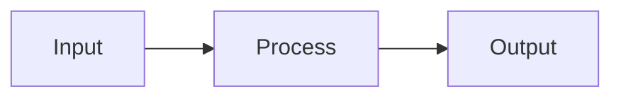

# Document Enhance

Produce a publication-quality `README.md` suitable for highly starred open source repos.

## Inputs

Before generating, gather:

1. **Project** – What it is, what it does, who it is for.
2. **Assets** – Logo URL, banner URL, screenshots, GIFs (paths or URLs).
3. **Optional sections** – Contributors grid, roadmap, FAQ, "why this over X", sponsors, license.

Use `[BRACKETS]` for any value the user must fill in. Output one complete, downloadable `README.md`.

## Output

One complete `README.md` (write to file or output for download), using the patterns below and `[BRACKETS]` for user-supplied content.

## Process

1. **Ask** – What is the project? What does it do? Who is it for? What assets exist (logo, banner, screenshots, GIFs)?
2. **Ask** – Which optional sections apply? (contributors, roadmap, FAQ, why-this-over-X, sponsors, etc.)
3. **Produce** – Full README using the patterns below, with `[BRACKETS]` for user-supplied content.
4. **Deliver** – Single `README.md` (write to file or output for download).

## Patterns (use these in the README)

### Hero and centered title

Centered main title (raw HTML, GitHub-rendered):

```html
<p align="center">
  <strong>[Project Name]</strong><br/>
  [One-line tagline]
</p>
```

Or minimal:

```html
<p align="center">
  [Project Name] – [tagline]
</p>
```

### Badges

**Project badges (link into repo)** – Prefer badges that link to folders or files in the project so readers can jump to agents, skills, docs, or license. Use relative paths (e.g. `.claude/agents`, `.claude/skills`, `LICENSE`). Detect or ask: agents path (e.g. `.claude/agents`), skills path (e.g. `.claude/skills`), license file (e.g. `LICENSE`). Include a License badge linking to the license file. If the repo is a GitHub template repo, include a "Use this template" badge linking to `https://github.com/[OWNER]/[REPO]/generate`. If it is not a template, include a "Clone this repo" (or similar) badge linking to `https://github.com/[OWNER]/[REPO]` so users can clone or open the repo. Do not add a generic "star this repo" badge; only link into the project or to template/clone actions.

**Use Markdown, not HTML:** See [document-github](../document-github/SKILL.md). Put badges in plain Markdown outside any HTML block so they render on GitHub. Do not put badges inside `<p align="center">` or other HTML.

Example (Markdown badges; adjust paths and labels to match the project):

```markdown
[](.claude/agents)
[](.claude/agents)
[](LICENSE)
[](https://github.com/[OWNER]/[REPO]/generate)
```

If the repo is **not** a template, use a "Clone this repo" badge linking to `https://github.com/[OWNER]/[REPO]` instead of "Use this template".

**Shields.io** – Base `https://img.shields.io/badge/<LABEL>-<MESSAGE>-<COLOR>.svg`; add `?style=flat` or `?style=for-the-badge`; optional `&logo=github` (or other [simple-icons](https://simpleicons.org/) name). URL-encode spaces as `%20`.

### Doc/source strip (below hero)

Horizontal rule then blockquote-style links:

```markdown
---

**Documentation**: [https://[docs-url]](https://[docs-url])

**Source Code**: [https://github.com/[OWNER]/[REPO]](https://github.com/[OWNER]/[REPO])

---
```

### Tagline blockquote

Styled one-liner:

```markdown
> [Catchphrase or positioning statement.]
```

### Feature list (bold key + description)

```markdown
The key features are:

* **Fast**: [Description.]
* **Easy**: [Description.]
* **Short**: [Description.]
```

### Screenshot / GIF (immediate visual impact)

Place early, after intro. Prefer one strong asset (screenshot or GIF). Use Markdown image syntax. For in-repo files (especially animated GIFs), use raw URL so they load and animate correctly on GitHub. See [document-github](../document-github/SKILL.md) for rules.

```markdown
![[Alt text]]([URL])
```

Use raw URL for repo assets: `https://raw.githubusercontent.com/[OWNER]/[REPO]/[BRANCH]/[path]/file.gif` (or .png).

### Code block (quickstart)

Always specify language for syntax highlighting. Keep minimal.

````markdown
```[lang]
[Minimal runnable snippet]
```
````

Optional: show expected output in a second block or inline.

### Collapsible sections (long content)

```html
<details>
<summary>Click to expand: [Section title]</summary>

[Markdown content and code blocks here.]

</details>
```

### Contributor grid (contrib.rocks)

```markdown
## Contributors

<a href="https://github.com/[OWNER]/[REPO]/graphs/contributors">
  
</a>
```

Optional query params: `?max=24&columns=6`.

### Technology / stack badges

Row of small flat badges (languages, frameworks, tools):

```markdown
[](https://python.org)
[](LICENSE)
```

### Horizontal rule section dividers

Use `---` between major sections to improve scanability.

### Centered footer strip

```html
<p align="center">
  <sub>Built with [optional emoji]. Licensed under [LICENSE].</sub><br/>
  <sub>If this helped you, consider <a href="https://github.com/[OWNER]/[REPO]">giving it a star</a>.</sub>
</p>
```

### Mermaid diagrams

For architecture or flow. GitHub renders Mermaid in `.md`:

````markdown

````

### Heading hierarchy and emoji

Use consistent levels: `#` once (title), then `##` for major sections, `###` for subsections. Optional emoji in headings for scanability:

```markdown
## Features
## Installation
## Usage
## Contributing
## License
```

With emoji:

```markdown
## Features
## Installation
## Usage
## FAQ
## License
```

### Table of contents (long READMEs)

```markdown
## Table of contents

- [Features](#features)
- [Installation](#installation)
- [Usage](#usage)
- [Contributing](#contributing)
- [License](#license)
```

Anchors: see [document-github](../document-github/SKILL.md) (lowercase, spaces to hyphens).

### Comparison / "why this" table

Emoji or check/cross for quick scan:

```markdown
| Feature        | This project | Alternative X |
|----------------|--------------|---------------|
| Speed          | Yes          | No            |
| Easy setup     | Yes          | Partial       |
```

### Alerts (GitHub blockquotes)

See [document-github](../document-github/SKILL.md). Supported: `[!NOTE]`, `[!TIP]`, `[!IMPORTANT]`, `[!WARNING]`, `[!CAUTION]`.

### Opinions / testimonials

Blockquote per quote, optional attribution:

```markdown
> "[Quote text.]"
>
> — [Name], [Role] ([ref link])
```

---

## README structure

Order content so readers can quickly decide relevance (broad first, detail later):

1. Hero + badges + optional logo/banner
2. Doc/source links (if any)
3. One-paragraph description + tagline
4. Single standout visual (screenshot or GIF)
5. Feature list (bullets with bold keys)
6. Installation (minimal steps)
7. Quickstart code + run instructions
8. Optional: TOC, then deeper sections (Usage, API, Config, etc.)
9. Optional: Contributors, Roadmap, FAQ, Why this over X
10. License + centered footer (star prompt optional)

## Quality rules

- **GitHub README rules:** See [document-github](../document-github/SKILL.md) for badges (Markdown, not inside HTML), image/GIF raw URLs, anchors, alerts.
- Use real badge URLs and image URLs; user fills `[OWNER]`, `[REPO]`, `[BRANCH]`, paths.
- Do not invent repo names, links, or assets; use `[BRACKETS]` placeholders.
- Prefer relative links for in-repo paths (e.g. `docs/guide.md`); for images/GIFs in README use raw URL per document-github.
- One code block per "minimal example"; add more in separate sections or details.
- If user provides existing markdown, preserve factual content and upgrade structure/patterns to match this skill.

## Reference

[document-github](../document-github/SKILL.md) – GitHub README rules (GIFs, raw URLs, badges in Markdown not HTML, anchors). [document](../document/SKILL.md) – Documenter skill. [Extend Claude with skills](https://code.claude.com/docs/en/skills.md).
