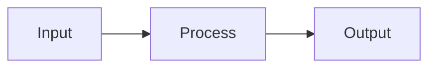

# Document Enhance

Produce a publication-quality `README.md` suitable for highly starred open source repos.

## Inputs

Before generating, gather:

1. **Project** – What it is, what it does, who it is for.
2. **Assets** – Logo URL, banner URL, screenshots, GIFs (paths or URLs).
3. **Optional sections** – Contributors grid, roadmap, FAQ, "why this over X", sponsors, license.

Use `[BRACKETS]` for any value the user must fill in. Output one complete, downloadable `README.md`.

## Process

1. **Ask** – What is the project? What does it do? Who is it for? What assets exist (logo, banner, screenshots, GIFs)?
2. **Ask** – Which optional sections apply? (contributors, roadmap, FAQ, why-this-over-X, sponsors, etc.)
3. **Produce** – Full README using the patterns below, with `[BRACKETS]` for user-supplied content.
4. **Deliver** – Single `README.md` (write to file or output for download).

## Patterns (use these in the README)

### Hero and centered title

Centered main title (raw HTML, GitHub-rendered):

```html
<p align="center">
  <strong>[Project Name]</strong><br/>
  [One-line tagline]
</p>
```

Or minimal:

```html
<p align="center">
  [Project Name] – [tagline]
</p>
```

### Badges

**Shields.io** – Flat (default) for body, `for-the-badge` for hero when desired.

- Base: `https://img.shields.io/badge/<LABEL>-<MESSAGE>-<COLOR>.svg`
- With style: `?style=flat` or `?style=for-the-badge`
- With logo: `&logo=github` (or other [simple-icons](https://simpleicons.org/) name)
- URL-encode spaces as `%20`, hyphen as `-`

**Badges inside raw HTML:** GitHub does not parse Markdown inside HTML (e.g. `<p align="center">`). If badges sit in a hero block, use HTML so they render:

```html
<p align="center">
  <a href="[LINK]"></a>
  <a href="https://github.com/[OWNER]/[REPO]/actions"></a>
</p>
```

Examples (markdown, use only when badges are **outside** HTML blocks):

```markdown
[](https://pypi.org/project/[PACKAGE]/)
[](LICENSE)
[](https://github.com/[OWNER]/[REPO]/actions)
```

Hero-style markdown (larger, pill-shaped) – only when **not** inside `<p>` or other HTML:

```markdown
[](LINK)
```

### Doc/source strip (below hero)

Horizontal rule then blockquote-style links:

```markdown
---

**Documentation**: [https://[docs-url]](https://[docs-url])

**Source Code**: [https://github.com/[OWNER]/[REPO]](https://github.com/[OWNER]/[REPO])

---
```

### Tagline blockquote

Styled one-liner:

```markdown
> [Catchphrase or positioning statement.]
```

### Feature list (bold key + description)

```markdown
The key features are:

* **Fast**: [Description.]
* **Easy**: [Description.]
* **Short**: [Description.]
```

### Screenshot / GIF (immediate visual impact)

Place early, after intro. Prefer one strong asset (screenshot or GIF).

```markdown
![[Alt text]]([URL or path])
```

Example: ``

### Code block (quickstart)

Always specify language for syntax highlighting. Keep minimal.

````markdown
```[lang]
[Minimal runnable snippet]
```
````

Optional: show expected output in a second block or inline.

### Collapsible sections (long content)

```html
<details>
<summary>Click to expand: [Section title]</summary>

[Markdown content and code blocks here.]

</details>
```

### Contributor grid (contrib.rocks)

```markdown
## Contributors

<a href="https://github.com/[OWNER]/[REPO]/graphs/contributors">
  
</a>
```

Optional query params: `?max=24&columns=6`.

### Technology / stack badges

Row of small flat badges (languages, frameworks, tools):

```markdown
[](https://python.org)
[](LICENSE)
```

### Horizontal rule section dividers

Use `---` between major sections to improve scanability.

### Centered footer strip

```html
<p align="center">
  <sub>Built with [optional emoji]. Licensed under [LICENSE].</sub><br/>
  <sub>If this helped you, consider <a href="https://github.com/[OWNER]/[REPO]">giving it a star</a>.</sub>
</p>
```

### Mermaid diagrams

For architecture or flow. GitHub renders Mermaid in `.md`:

````markdown

````

### Heading hierarchy and emoji

Use consistent levels: `#` once (title), then `##` for major sections, `###` for subsections. Optional emoji in headings for scanability:

```markdown
## Features
## Installation
## Usage
## Contributing
## License
```

With emoji:

```markdown
## Features
## Installation
## Usage
## FAQ
## License
```

### Table of contents (long READMEs)

```markdown
## Table of contents

- [Features](#features)
- [Installation](#installation)
- [Usage](#usage)
- [Contributing](#contributing)
- [License](#license)
```

Anchors: lowercase, spaces to hyphens, punctuation removed (GitHub auto-generates these from headings).

### Comparison / "why this" table

Emoji or check/cross for quick scan:

```markdown
| Feature        | This project | Alternative X |
|----------------|--------------|---------------|
| Speed          | Yes          | No            |
| Easy setup     | Yes          | Partial       |
```

### Alerts (GitHub blockquotes)

```markdown
> [!NOTE]
> Useful information.

> [!TIP]
> Helpful advice.

> [!IMPORTANT]
> Key information.
```

### Opinions / testimonials

Blockquote per quote, optional attribution:

```markdown
> "[Quote text.]"
>
> — [Name], [Role] ([ref link])
```

---

## README structure

Order content so readers can quickly decide relevance (broad first, detail later):

1. Hero + badges + optional logo/banner
2. Doc/source links (if any)
3. One-paragraph description + tagline
4. Single standout visual (screenshot or GIF)
5. Feature list (bullets with bold keys)
6. Installation (minimal steps)
7. Quickstart code + run instructions
8. Optional: TOC, then deeper sections (Usage, API, Config, etc.)
9. Optional: Contributors, Roadmap, FAQ, Why this over X
10. License + centered footer (star prompt optional)

## Quality rules

- **Badges in hero:** If the hero uses `<p align="center">` (or any raw HTML), put badges inside it as HTML `<a href="..."></a>`. Do not use Markdown `[](...)` inside HTML; GitHub does not parse it and badges show as raw text.
- Use real badge URLs and image URLs; user fills `[OWNER]`, `[REPO]`, `[BRANCH]`, paths.
- Do not invent repo names, links, or assets; use `[BRACKETS]` placeholders.
- Prefer relative links for in-repo paths (e.g. `docs/guide.md`, `assets/logo.png`).
- One code block per "minimal example"; add more in separate sections or details.
- If user provides existing markdown, preserve factual content and upgrade structure/patterns to match this skill.
