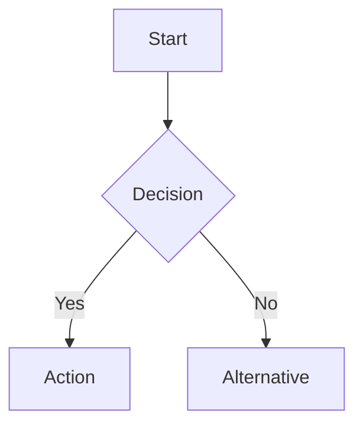
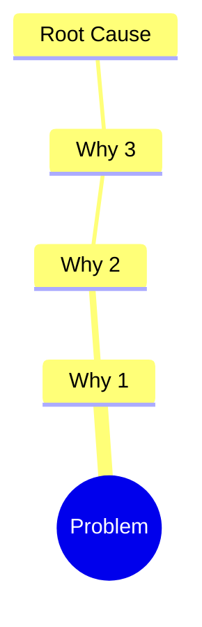

# Document Findings

Takes research output and produces structured, enhanced markdown documentation.

## Inputs

1. **Project path** - `work/{team}/{space}/{project}/`
2. **Source material** - Research output to structure
3. **Document type** - One of: `research`, `analysis`, `solutions`, `project-overview`

If the project path or source material is missing, ask the user before proceeding.

Valid team and space values are defined in `work/config.md`.

## Output

All project documentation lives in a single file: `work/{team}/{space}/{project}/README.md`. Do not create other files (notes, drafts, separate docs) for the project; write everything into this README.

## Markdown Standards

### Headings
Use H2 (`##`) as top-level within documents. Reserve H1 (`#`) for the document title only.

### Mermaid Diagrams

Use mermaid for:
- **Flowcharts** - Processes, workflows, decision trees
- **Sequence diagrams** - Multi-step interactions
- **Mind maps** - Problem breakdowns, topic relationships
- **Gantt charts** - Timelines, phases

Example for a workflow:
````markdown

````

Example for root cause:
````markdown

````

### Tables
Use tables for structured comparisons, source indexes, and feature matrices. Only add rows when source material provides real data. Never add placeholder rows, TBD, example data, or made-up names/dates/artifacts.

### Callouts
Use blockquotes with bold labels for callouts:
```markdown
> **Note:** Additional context here.

> **Warning:** Risk or caveat here.
```

### Links and Sources
Always cite sources inline with markdown links. Group full source lists in tables.

**Clickable links:** Every reference to a source or URL must use markdown link syntax `[title](url)` so it renders as a clickable link in the README. Never write the link title and URL as separate plain text or as a bare URL.

## Process

### 1. Read Source Material
Read all files from the source path. Understand the scope and topics covered.

### 2. Organize by Sections
Map content into the README sections based on document type.

### 3. Write README
- Start with a clear title and one-line summary
- Use mermaid diagrams where relationships or flows exist
- Use tables where comparisons or indexes exist
- Keep paragraphs short (3-4 sentences max)
- Cite sources inline

### 4. README Structure

Use a single README with three phases. Link between them at the top. Notes, current-state review, competitor audit, and similar material go in **Audits** (under Discovery). Section headers below describe what goes in each place when source material provides it; do not populate tables or sections with placeholder, example, or made-up data. If there is no real data for a table or subsection, leave it empty or omit it.

```markdown
# {Project Name}
[Discovery](#discovery) | [Exploration](#exploration) | [Go to market](#go-to-market)

---
## Discovery

### Project tracking
- **Team:** One row per person. Name = individual contributor (person's full name, not team or space). Responsibility = exactly one of: **Driver**, **Approver**, **Contributor**, **Informed** (DACI only; no other values). Example: ticket assignee (e.g. Ryan Allen on the UX ticket) is **Contributor**; the person who assigned the ticket is at least **Informed** (and may also be Driver, Approver, or Contributor).
- **Roadmap:** Project + ticket | Due date.
- **Measurements:** Name | Current state | Desired state.

### Audits
Notes, current-state review, competitor review. Track artifacts in Exploration > Artifacts. When source material includes a **Link tree** or **Sources** section (e.g. from learn output), preserve it here: include a "Link tree" subsection with the full traversal map and optionally a Sources table so every crawled link remains in the README.

### Users + Needs
Users raw & encoded needs (User | Time/date | Verbatim | Encoded needs). Sorted needs. Refined problem statement (In which way might we enable ${user} to solve ${mainNeed1} & ${mainNeed2}, to ${userGoal} & ${businessGoal}?).

---
## Exploration

### Ideation
Hypotheses (If | then | due to).

### Collaboration
Artifacts table (Date | Creator | Artifact).

### Validation
Test plan (general, users, goals). User testing results (Version | KPI 1 | KPI 2).

---
## Go to market

### Deliverables
Designs for engineers (Date | Creator | Artifact). Production roadmap (Project name | Due date | Status | Person assigned).

### Performance
Quality assurance. Production testing (Version | KPI 1 | KPI 2).

### Next version
Learnings. Recommendations. Links to new docs.
```

## Rules

- Never use absolute filesystem paths in links. All links must be relative to the document they appear in
- Every source or URL reference must be a markdown link `[title](url)` so it is clickable; never plain text title with URL elsewhere or bare URL
- Never invent information not present in source material. No placeholder or made-up content anywhere: no fake table rows, no TBD, no example names/dates/artifacts in Deliverables, Project tracking, Roadmap, or any other section. Only real data from source material; leave sections or tables empty when there is nothing to put.
- In Project tracking > Team: Name must be an individual person (full name). Responsibility must be exactly one of Driver, Approver, Contributor, Informed (DACI). No other roles or labels.
- When structuring from research that includes a Link tree or Sources section, preserve them in the README (e.g. under Discovery > Audits) so the full link tree is always present
- Always attribute content to its source
- Use mermaid diagrams for any process with 3+ steps or any hierarchy with 2+ levels
- Always include a table of contents after the H1 title linking to all H2 sections
