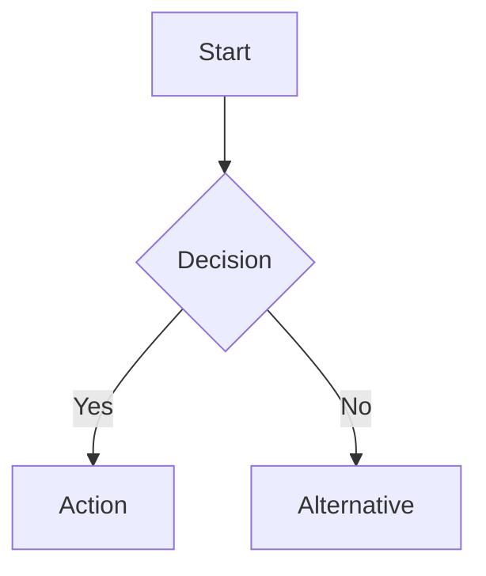
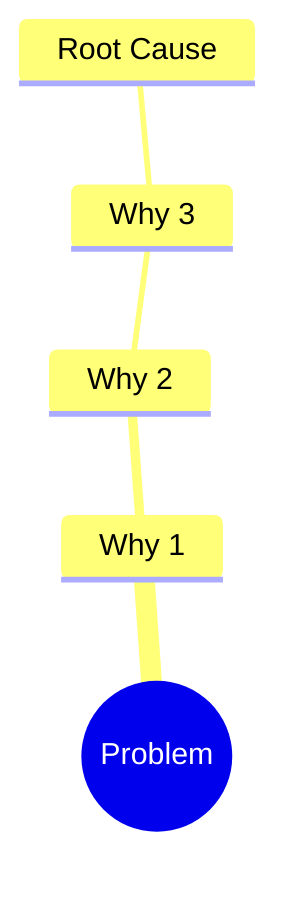

# Document

Take research output and produce structured, enhanced markdown documentation.

## Inputs

1. **Project path** – See [work/paths.md](../../work/paths.md).
2. **Source material** – Research output to structure.
3. **Document type** – One of: `research`, `analysis`, `solutions`, `project-overview`.

## Output

Write to the project README at the path from work/paths.md.

## Required on every README

1. **Top navigation** – After the H1 title, add one line linking to every H2 and H3. Horizontal, compact: `[🔍 Discovery](#discovery) | [📋 Project tracking](#project-tracking) | …` Include only sections that exist. Anchor targets: lowercase, hyphens for spaces (e.g. `#discovery`, `#project-tracking`).
2. **Emoji on headings** – Every H1, H2, and H3 must start with an emoji.

## Markdown standards

### Headings
H1, H2, and H3 start with an emoji.

### Mermaid
Use mermaid for flowcharts (processes, workflows, decision trees), sequence diagrams (multi-step interactions), mind maps (problem breakdowns, topic relationships), and Gantt charts (timelines, phases). Use for any process with 3+ steps or any hierarchy with 2+ levels.

Example workflow:
````markdown

````

Example root cause:
````markdown

````

### Tables
Structured comparisons, source indexes, feature matrices. Only add rows when source material provides real data. No placeholder rows, TBD, example data, or made-up names/dates/artifacts.

### Callouts
Blockquotes with bold labels: `> **Note:** ...` and `> **Warning:** ...`

### Links
Cite sources inline with markdown links. Every reference to a source or URL must use `[title](url)`. Link everything that can be linked: sections (via top nav), URLs, people (anchor per person in Team, link name to that anchor elsewhere), tickets, artifacts/docs with URLs. Never use absolute filesystem paths; links relative to the document.

## Process

1. **Read source material** – All files from source path; understand scope and topics.
2. **Organize by sections** – Map content into README sections by document type.
3. **Write README** – Clear title and one-line summary; mermaid where relationships or flows exist; tables where comparisons exist; short paragraphs (3–4 sentences); cite sources inline.
4. **Apply README structure** – One README per project (path from work/paths.md). Put everything in this README; no separate docs. Exhaustive: do not summarize or cut. Evidence assets: see work/paths.md.

### README structure (three phases)

Single README with Discovery, Exploration, Go to market. Notes, current-state review, competitor audit go in **Audits** (under Discovery). Only populate sections/tables when source material provides real data; otherwise leave empty or omit.

```markdown
# 📄 {Project Name}
[🔍 Discovery](#discovery) | [📋 Project tracking](#project-tracking) | [📑 Audits](#audits) | [👥 Users + Needs](#users--needs) | [🔎 Exploration](#exploration) | [💡 Ideation](#ideation) | [📎 Artifacts](#artifacts) | [✅ Validation](#validation) | [🚀 Go to market](#go-to-market) | [📦 Deliverables](#deliverables) | [📈 Performance](#performance) | [🔜 Next version](#next-version)

---
## 🔍 Discovery

### 📋 Project tracking
- **Team:** One row per person. Name = individual (full name). Responsibility = exactly one of: **Driver**, **Approver**, **Contributor**, **Informed** (DACI only).
- **Roadmap:** Project + ticket | Due date.
- **Measurements:** Name | Current state | Desired state.

### 📑 Audits
Notes, current-state review, competitor review. When source has Link tree or Sources (from research), preserve here: Link tree subsection and Sources table.

### 👥 Users + Needs
User | Time/date | Verbatim | Encoded needs. Sorted needs. Refined problem statement (In which way might we enable ${user} to solve ${mainNeed1} & ${mainNeed2}, to ${userGoal} & ${businessGoal}?).

---
## 🔎 Exploration

### 💡 Ideation
Hypotheses (If | then | due to).

### 📎 Artifacts
Date | Creator | Artifact. Drawings, surveys, flows, prototypes, UI, code repos. Design files: link or list with Creator and Artifact.

### ✅ Validation
Test plan (general, users, goals). User testing results (Version | KPI 1 | KPI 2).

---
## 🚀 Go to market

### 📦 Deliverables
Designs for engineers (Date | Creator | Artifact). Production roadmap (Project | Due date | Status | Person).

### 📈 Performance
QA. Production testing (Version | KPI 1 | KPI 2).

### 🔜 Next version
Learnings. Recommendations. Links to new docs.
```

## Rules

- H1, H2, H3 start with an emoji. Top nav after H1: horizontal, compact, link every H2 and H3.
- No absolute filesystem paths in links; relative to the document only.
- No invented content. Only real data from source; no placeholder rows, TBD, or made-up names/dates/artifacts. Empty or omit when no data.
- Project tracking > Team: Name = individual person (full name). Responsibility = Driver | Approver | Contributor | Informed only.
- When research includes Link tree or Sources, preserve under Discovery > Audits.
- Always attribute content to its source.
